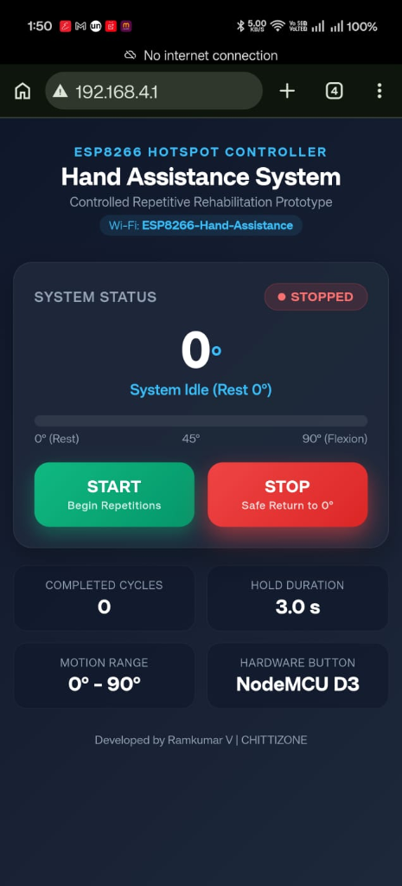

# ESP8266 Servo-Based Hand Assistance System (Wi-Fi Web Server & Button Control)

A low-cost servo-based hand assistance prototype designed to demonstrate controlled and repetitive hand movement using an ESP8266 NodeMCU V3, featuring an autonomous **Wi-Fi Hotspot Access Point**, an embedded **Web Server Control Dashboard**, and a **Physical Hardware Push-button**.

<p align="center">
  
  <br>
  <em>ESP8266 Hand Assistance Hardware Prototype Setup with SG90 Servo Actuators</em>
</p>

The system controls a servo motor through the ESP8266 and performs a continuous, non-blocking rehabilitation cycle when started:

**0° (Rest) → 90° (Flexion) → Hold 3 seconds → 90° → 0° (Extension) → Hold 3 seconds → Repeat**

> **Note:** This is an experimental engineering prototype and is not a certified medical device.

---

## Key Features

- **Standalone Wi-Fi Hotspot (SoftAP)**: Broadcasts its own private Wi-Fi network (`ESP8266-Hand-Assistance`). No home Wi-Fi router or internet connection needed.
- **Embedded Web Control Dashboard**: Access the mobile-friendly web dashboard directly by browsing to `http://192.168.4.1`.
- **Interactive Web Controls**: Touch/click **START** and **STOP** action buttons with real-time motion telemetry, angle progress bar, and cycle counter.
- **Physical Push-Button Control**: Hardware push button on NodeMCU pin `D3` (GPIO0) to toggle Start/Stop directly on the device with hardware debounce.
- **Safe Stop & Return**: Pressing STOP at any point during movement triggers a smooth, controlled return back to 0° (Rest position).
- **Non-blocking State Machine**: Motion engine uses `millis()` timing, allowing instantaneous response to Web commands and button presses without freezing the processor.

---

## Project Overview

Hand mobility can be affected by neurological conditions, injuries, or other physical limitations. Assistive robotic mechanisms can potentially provide controlled repetitive movement to support rehabilitation research.

This project demonstrates the electronic control and wireless interface system using:

- ESP8266 NodeMCU V3
- SG90 / MG995 / MG996R Servo motor
- Physical Push-button (Start/Stop)
- External 5 V power supply
- Arduino IDE with ESP8266 Core

---

## Working Principle & State Machine

The firmware uses a non-blocking finite state machine (FSM) executed alongside the HTTP web server and hardware button polling.

```text
               +------------------------------------+
               |         [POWER ON / RESET]         |
               +-----------------+------------------+
                                 |
                                 v
               +-----------------+------------------+
               |        STATE_STOPPED (0° Rest)     |<----------------+
               +-----------------+------------------+                 |
                                 |                                    |
                    [START: Web Button or D3 Pin]                     |
                                 |                                    |
                                 v                                    |
+------------->+-----------------+------------------+                 |
|              |      STATE_MOVING_TO_MAX           |                 |
|              |     Smooth Step 0° -> 90° (15ms)   |                 |
|              +-----------------+------------------+                 |
|                                |                                    |
|              +-----------------+------------------+                 |
|              |         STATE_HOLD_MAX             |                 |
|              |        Holding for 3000 ms         |                 |
|              +-----------------+------------------+                 |
|                                |                                    |
|              +-----------------+------------------+                 |
|              |      STATE_MOVING_TO_MIN           |                 |
|              |     Smooth Step 90° -> 0° (15ms)   |                 |
|              +-----------------+------------------+                 |
|                                |                                    |
|              +-----------------+------------------+                 |
|              |         STATE_HOLD_MIN             |                 |
|              |        Holding for 3000 ms         |                 |
|              +-----------------+------------------+                 |
|                                |                                    |
|                         [Still Running?]                            |
|                       /                \                            |
|                 (YES)/                  \(NO)                       |
+---------------------+                    +--------------------------+
                                           |  STATE_RETURNING_TO_REST |
                                           |  Smooth Step down to 0°  |
                                           +-------------+------------+
                                                         |
                                                         +------------+
```

---

## Wi-Fi Hotspot & Web Dashboard Guide

### 1. Connecting to the Device Hotspot
1. Power on the NodeMCU system.
2. On your smartphone, tablet, or laptop, scan for available Wi-Fi networks.
3. Connect to the Wi-Fi network:
   - **SSID**: `ESP8266-Hand-Assistance`
   - **Password**: `12345678`
4. Open your web browser (Chrome, Safari, Edge, Firefox) and navigate to:
   - **URL**: `http://192.168.4.1`

### 2. Dashboard Interface

<p align="center">
  
  <br>
  <em>Mobile Web Control Dashboard accessed via Hotspot at http://192.168.4.1</em>
</p>

The web page displays:
- **System Status Badge**: Indicates `RUNNING` (Green Glow) or `STOPPED` (Red).
- **Live Angle Indicator & Gauge**: Real-time display of the servo's current angle from `0°` to `90°`.
- **Motion Phase Subtitle**: `Flexion (0° → 90°)`, `Holding at 90°`, `Extension (90° → 0°)`, `Holding at 0°`, or `Idle`.
- **START Button**: Commences the continuous exercise cycle.
- **STOP Button**: Safely stops the cycle and returns the servo to 0°.
- **Cycle Counter**: Tracks total completed 0° → 90° → 0° cycles in real time.

### 3. REST API Endpoints
| HTTP Method | Endpoint | Description | JSON Response Sample |
|---|---|---|---|
| `GET` | `/` | Web UI Dashboard | HTML Page |
| `POST` / `GET` | `/start` | Start repetitive cycle | `{"running":true,"angle":0,"state":"Flexion...","cycles":0}` |
| `POST` / `GET` | `/stop` | Stop & return safely to 0° | `{"running":false,"angle":30,"state":"Stopping...","cycles":3}` |
| `GET` | `/status` | Telemetry polling | `{"running":true,"angle":75,"state":"Flexion...","cycles":4}` |

---

## Hardware Requirements

| Component | Quantity | Purpose | Pin Connection |
|---|---:|---|---|
| ESP8266 NodeMCU V3 | 1 | Main Controller & Wi-Fi Server | — |
| Servo Motor (SG90 / MG996R) | 1 | Hand Movement Actuator | Signal → `D4` (GPIO2) |
| Tactile Push-Button | 1 | Hardware Start / Stop Toggle | Pin 1 → `D3` (GPIO0), Pin 2 → `GND` |
| 5 V External Power Supply (2A) | 1 | Dedicated Servo Power | `+5V` → Servo Red, `GND` → Servo Brown & ESP GND |
| Jumper Wires & Breadboard | As required | Circuit Interconnects | — |
| USB Cable | 1 | Programming & ESP8266 Power | Micro-USB |

---

## Circuit Connections

```text
                            ESP8266 NodeMCU V3
                         ┌───────────────────────┐
                         │                       │
                         │  D4 / GPIO2 ──────────┼────────── Servo Signal (Orange/Yellow)
                         │                       │
                         │  D3 / GPIO0 ────┐     │
                         │                 │     │
                         │  GND ───────────┼─┬───┼──────────┐
                         └─────────────────┼─┼───┘          │
                                           │ │              │
                                           │ │              │
                         ┌─────────────────┘ │              │
                         │   [ Push Button ] │              │
                         └───────────────────┘              │
                                                            │
    External 5V Power Supply                                │
    ┌─────────────────────────┐                             │
    │  +5V (Positive) ────────┼──────────────────────── Servo VCC (Red)
    │                         │                             │
    │  GND (Negative) ────────┼───────────────────────── Servo GND (Brown/Black)
    └─────────────────────────┘
```

> **Crucial Ground Connection:** The **ESP8266 GND** and the **External Power Supply GND** must be tied together (Common Ground) to ensure a shared voltage reference for the PWM signal.

---

## Source Code (`src/hand_assistance.ino`)

```cpp
#include <ESP8266WiFi.h>
#include <ESP8266WebServer.h>
#include <Servo.h>

#define SERVO_PIN   D4   // GPIO2 - Servo Signal
#define BUTTON_PIN  D3   // GPIO0 - Physical Start/Stop Button (Active LOW)

const char *AP_SSID = "ESP8266-Hand-Assistance";
const char *AP_PASS = "12345678";

ESP8266WebServer server(80);
Servo handServo;

const int MIN_ANGLE = 0;
const int MAX_ANGLE = 90;
const int STEP_DELAY_MS = 15;
const unsigned long HOLD_TIME_MS = 3000;

enum MotionState {
  STATE_STOPPED,
  STATE_MOVING_TO_MAX,
  STATE_HOLD_MAX,
  STATE_MOVING_TO_MIN,
  STATE_HOLD_MIN,
  STATE_RETURNING_TO_REST
};

MotionState currentState = STATE_STOPPED;
bool isRunning = false;
int currentAngle = 0;
unsigned long lastStepTime = 0;
unsigned long holdStartTime = 0;
unsigned long cycleCount = 0;

// Button Debounce
int lastButtonState = HIGH;
int buttonState = HIGH;
unsigned long lastDebounceTime = 0;
const unsigned long debounceDelay = 50;

// Refer to src/hand_assistance.ino for the complete HTML and Web Server implementation.
```

---

## Timing Parameters

| Parameter | Default Value | Description |
|---|---:|---|
| Minimum Angle | `0°` | Resting / open hand angle |
| Maximum Angle | `90°` | Flexion / closed hand angle |
| Step Interval | `15 ms` | Time between 1° position increments |
| Hold Duration | `3000 ms` | Rest time at 0° and 90° |
| Debounce Delay | `50 ms` | Hardware button noise suppression |

---

## Project Specifications

| Specification | Value |
|---|---|
| Controller | ESP8266 NodeMCU V3 (ESP-12E) |
| Wi-Fi Mode | SoftAP (Access Point) |
| AP IP Address | `192.168.4.1` |
| Web Server Port | Port 80 (HTTP) |
| Actuator | Servo Motor (SG90 / MG995 / MG996R) |
| Control Interfaces | Wi-Fi Web Dashboard + Physical Push-Button (D3) |
| Movement Profile | Non-blocking Smooth Interpolation (15 ms/deg) |
| Programming IDE | Arduino IDE |
| Power Requirements | 5V DC (2A recommended for servos) |

---

## Project Status

### Completed
- [x] ESP8266 SoftAP Wi-Fi hotspot configuration (`ESP8266-Hand-Assistance`)
- [x] Embedded responsive HTML/CSS/JavaScript Web Control Dashboard
- [x] Web START & STOP asynchronous button controls with live angle gauge
- [x] Physical push-button integration on pin `D3` (GPIO0) with debounce
- [x] Non-blocking state machine engine replacing blocking delays
- [x] Safe auto-return to 0° rest position upon stopping
- [x] Cycle counter and telemetry REST API (`/status`)
- [x] Comprehensive documentation and circuit schematics

### In Progress / Future
- [ ] Multi-finger actuation with PCA9685 I2C servo driver
- [ ] Flex sensor and force feedback closed-loop control
- [ ] Web-configurable angle limits and speed presets
- [ ] OLED real-time status display

---

## License

This project is licensed under the MIT License - see the [LICENSE](LICENSE) file for details.
