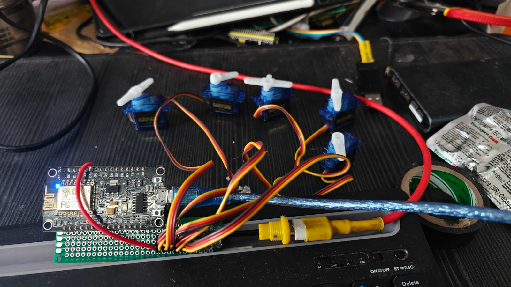

# ESP8266 Servo-Based Hand Assistance System

A low-cost servo-based hand assistance prototype designed to demonstrate controlled and repetitive hand movement using an ESP8266 NodeMCU V3.

The system controls a servo motor through the ESP8266 and performs a continuous movement cycle:

**0° → 90° → Hold 3 seconds → 90° → 0° → Hold 3 seconds → Repeat**

> **Note:** This is an experimental engineering prototype and is not a certified medical device.

---

## Project Overview

Hand mobility can be affected by neurological conditions, injuries, or other physical limitations. Assistive robotic mechanisms can potentially provide controlled repetitive movement to support rehabilitation research.

This project demonstrates the basic electronic control system for such a mechanism using:

- ESP8266 NodeMCU V3
- Servo motor
- External 5 V power supply
- Arduino IDE

The servo moves smoothly between two predefined angular positions and holds each position for a fixed duration.

---

## Objectives

- Develop a simple servo-based hand assistance prototype.
- Control servo movement using an ESP8266.
- Generate smooth and repeatable angular movement.
- Implement configurable movement and holding times.
- Provide a foundation for a future multi-servo hand-assistance system.
- Enable future integration of sensors and wireless control.

---

## Working Principle

The ESP8266 generates the PWM control signal required by the servo motor.

### Movement Sequence

```text
                    START
                      |
                      v
                    0°
                      |
                      | Smooth Movement
                      v
                    90°
                      |
                      | Hold 3 Seconds
                      v
                    90°
                      |
                      | Smooth Movement
                      v
                     0°
                      |
                      | Hold 3 Seconds
                      v
                   REPEAT
```

The servo moves one degree at a time with a 15 ms delay between each step.

---

## Hardware Requirements

| Component | Quantity | Purpose |
|---|---:|---|
| ESP8266 NodeMCU V3 | 1 | Main controller |
| Servo Motor | 1 | Hand movement actuator |
| 5 V External Power Supply | 1 | Servo power |
| Jumper Wires | As required | Connections |
| USB Cable | 1 | Programming and ESP8266 power |
| Mechanical Linkage | As required | Hand mechanism |

### Future Components

- Flex sensor
- Force sensor
- Limit switch
- Emergency stop
- OLED display
- Battery
- Multiple servo motors
- PCA9685 servo driver
- Wi-Fi control interface

---

# Circuit Connections

### Servo Signal

```text
ESP8266 NodeMCU V3
        |
        | D4 / GPIO2
        |
        v
    Servo Signal
```

### Servo Power

```text
External 5V Supply
        |
        +---------- Servo VCC
        |
       GND
        |
        +---------- Servo GND
        |
        +---------- ESP8266 GND
```

### Complete Connection

```text
             ESP8266 NodeMCU V3
            ┌───────────────────┐
            │                   │
            │ D4 / GPIO2 ───────┼──────── Servo Signal
            │                   │
            │ GND ──────────────┼────┐
            └───────────────────┘    │
                                     │
                              Servo GND
                                     │
External 5V Supply                   │
┌───────────────┐                    │
│  +5V ─────────┼──────────────── Servo VCC
│               │
│  GND ─────────┼──────────────── Servo GND
└───────────────┘
```

**Important:** The ESP8266 GND and the external servo power-supply GND must be connected together.

---

# Power Supply

The ESP8266 operates using 3.3 V logic, while typical hobby servos operate from approximately 5 V.

For a single servo prototype, the servo should preferably be powered from a suitable external 5 V supply.

For multiple servos, calculate the required current based on the servo specifications.

### Do not:

```text
Servo VCC → ESP8266 3.3V
```

This can overload the ESP8266's 3.3 V supply.

---

# Software Requirements

- Arduino IDE
- ESP8266 Board Package
- Servo Library

### Arduino IDE Board Selection

Select:

```text
Tools
 → Board
   → ESP8266 Boards
     → NodeMCU 1.0 (ESP-12E Module)
```

Recommended settings:

```text
Board          : NodeMCU 1.0 (ESP-12E Module)
CPU Frequency  : 80 MHz
Upload Speed   : 115200
```

---

# Project Structure

```text
ESP8266-Hand-Assistance/
│
├── README.md
│
├── src/
│   └── hand_assistance.ino
│
├── hardware/
│   ├── circuit_diagram.png
│   └── wiring_diagram.png
│
├── docs/
│   └── project_documentation.pdf
│
├── media/
│   ├── prototype.jpg
│   └── demonstration.mp4
│
└── LICENSE
```

---

# Source Code

```cpp
#include <Servo.h>

Servo handServo;

#define SERVO_PIN D4

void moveServoSmooth(int fromAngle, int toAngle)
{
  if (fromAngle < toAngle)
  {
    for (int angle = fromAngle; angle <= toAngle; angle++)
    {
      handServo.write(angle);
      delay(15);
    }
  }
  else
  {
    for (int angle = fromAngle; angle >= toAngle; angle--)
    {
      handServo.write(angle);
      delay(15);
    }
  }
}

void setup()
{
  handServo.attach(SERVO_PIN);

  // FIRST POSITION = 0°
  handServo.write(0);
  delay(1000);
}

void loop()
{
  // 0° → 90°
  moveServoSmooth(0, 90);

  // Hold at 90° for 3 seconds
  delay(3000);

  // 90° → 0°
  moveServoSmooth(90, 0);

  // Hold at 0° for 3 seconds
  delay(3000);
}
```

---

# Code Explanation

## Servo Library

```cpp
#include <Servo.h>
```

Includes the Arduino Servo library used to control the servo.

## Servo Object

```cpp
Servo handServo;
```

Creates a servo object called `handServo`.

## GPIO

```cpp
#define SERVO_PIN D4
```

The servo signal is connected to **D4 / GPIO2**.

## Attach Servo

```cpp
handServo.attach(SERVO_PIN);
```

Connects the servo control object to D4.

## Initial Position

```cpp
handServo.write(0);
```

Sets the initial commanded position to 0°.

## Smooth Movement

```cpp
moveServoSmooth(0, 90);
```

Gradually moves the servo from 0° to 90°.

Instead of immediately jumping to 90°, the program sends:

```text
0°
1°
2°
3°
...
88°
89°
90°
```

with a 15 ms delay between each step.

---

# Timing

Current parameters:

| Parameter | Value |
|---|---:|
| Initial angle | 0° |
| Maximum angle | 90° |
| Step size | 1° |
| Step delay | 15 ms |
| Hold at 90° | 3 seconds |
| Hold at 0° | 3 seconds |

### Approximate movement time

```text
90 × 15 ms
= 1350 ms
≈ 1.35 seconds
```

### Approximate complete cycle

```text
Opening       ≈ 1.35 seconds
Hold          = 3 seconds
Closing       ≈ 1.35 seconds
Hold          = 3 seconds

Total         ≈ 8.7 seconds
```

---

# Customization

## Change Maximum Angle

For example, to use 60°:

```cpp
moveServoSmooth(0, 60);
```

and:

```cpp
moveServoSmooth(60, 0);
```

For 120°:

```cpp
moveServoSmooth(0, 120);
```

and:

```cpp
moveServoSmooth(120, 0);
```

The actual safe mechanical angle must be determined from the mechanism.

---

## Change Holding Time

Current:

```cpp
delay(3000);
```

### 5 seconds

```cpp
delay(5000);
```

### 1 second

```cpp
delay(1000);
```

---

## Change Movement Speed

Current:

```cpp
delay(15);
```

Smaller value:

```cpp
delay(10);
```

→ Faster movement.

Larger value:

```cpp
delay(25);
```

→ Slower movement.

---

# Multiple Servo Expansion

The current prototype uses one servo.

A future version can use multiple servos for different fingers.

```text
                  ESP8266
                     |
        ┌────────────┼────────────┐
        |            |            |
     Servo 1      Servo 2      Servo 3
     Finger 1     Finger 2     Finger 3
```

If all servos need exactly the same movement, they can potentially receive the same control signal.

However, if each finger requires independent movement, each servo requires an independent control channel.

For a larger number of servos, a **PCA9685 servo driver** can be considered.

---

# Future Development

### Hardware

- [ ] Mechanical hand mechanism
- [ ] Multiple finger actuation
- [ ] Flex sensors
- [ ] Force sensors
- [ ] Limit switches
- [ ] Emergency stop
- [ ] Battery-powered operation
- [ ] Servo driver

### Software

- [ ] Adjustable servo angles
- [ ] Adjustable movement speed
- [ ] Adjustable holding time
- [ ] Repetition counter
- [ ] Sensor feedback
- [ ] Fault detection
- [ ] Wireless configuration
- [ ] Web-based control interface

### Advanced Development

```text
Sensors
   |
   v
ESP8266
   |
   v
Control Algorithm
   |
   v
Servo Driver
   |
   v
Multiple Servos
   |
   v
Mechanical Hand
```

A future closed-loop system can use sensors to measure actual finger position and adjust servo movement accordingly.

---

# Testing Procedure

## Stage 1 — Electronic Testing

Test the servo without attaching it to a person's hand.

Verify:

- ESP8266 powers correctly.
- Servo starts at 0°.
- Servo moves smoothly to 90°.
- Servo holds for 3 seconds.
- Servo returns to 0°.
- Cycle repeats continuously.

## Stage 2 — Mechanical Testing

Connect the servo to the mechanical prototype.

Check:

- Mechanical travel
- Linkage alignment
- Servo torque
- Mechanical friction
- Range of motion
- Stall conditions

## Stage 3 — Safety Testing

Before human interaction, implement:

- Mechanical limits
- Software angle limits
- Force limitation
- Emergency stop
- Current monitoring

---

# Troubleshooting

## Servo Does Not Move

Check:

```text
D4 → Servo Signal
5V → Servo VCC
GND → Servo GND
```

Make sure:

```text
ESP8266 GND = Servo Power Supply GND
```

---

## ESP8266 Keeps Restarting

This is commonly caused by insufficient servo power or voltage drops.

Use a dedicated 5 V supply with sufficient current capacity.

---

## Servo Is Shaking

Possible causes:

- Insufficient power
- Poor grounding
- Electrical noise
- Mechanical load
- Loose wiring
- Low-quality servo

---

## Servo Moves in the Wrong Direction

The physical linkage determines the final movement direction.

Change the angle range in software if required.

---

# Project Specifications

| Specification | Value |
|---|---|
| Controller | ESP8266 NodeMCU V3 |
| Microcontroller | ESP8266 |
| GPIO | D4 / GPIO2 |
| Actuator | Servo Motor |
| Initial Position | 0° |
| Maximum Test Position | 90° |
| Movement | Smooth |
| Step Size | 1° |
| Step Delay | 15 ms |
| Hold Time | 3 seconds |
| Control Method | Servo PWM |
| Programming IDE | Arduino IDE |
| Prototype Type | Assistive Robotics |

---

# Project Status

### Completed

- [x] ESP8266 setup
- [x] Servo control
- [x] 0° startup position
- [x] Smooth servo movement
- [x] 0° → 90° movement
- [x] 3-second hold
- [x] 90° → 0° movement
- [x] 3-second hold
- [x] Continuous operation

### In Progress / Future

- [ ] Mechanical hand mechanism
- [ ] Multi-finger control
- [ ] Flex sensor integration
- [ ] Force sensing
- [ ] Emergency stop
- [ ] Adjustable parameters
- [ ] Battery operation
- [ ] Wireless control
- [ ] Closed-loop control
- [ ] Safety validation

---

# Safety Disclaimer

This project is an **engineering prototype** intended for educational, research, and development purposes.

It is **not a certified medical device** and has not been clinically validated.

The current servo angles, movement speed, torque, and timing parameters must not be assumed to be safe for direct human use.

Before connecting the mechanism to a person's hand, appropriate mechanical safety measures, force limitation, emergency stopping, electrical protection, testing, and professional evaluation are required.

---

# Demonstration

Add your project demonstration video here:

```markdown
[Watch Project Demonstration](YOUR_VIDEO_LINK)
```

Add your prototype image:

```markdown

```

---

# Author

**Ramkumar V**

Mechatronics Engineering  
Embedded Systems | Robotics | Automation | PCB Design

---

# Acknowledgement

This project was developed as an embedded-systems and assistive-robotics prototype to explore controlled robotic movement for hand-assistance applications.

---

# License

This project is licensed under the MIT License - see the [LICENSE](LICENSE) file for details.
